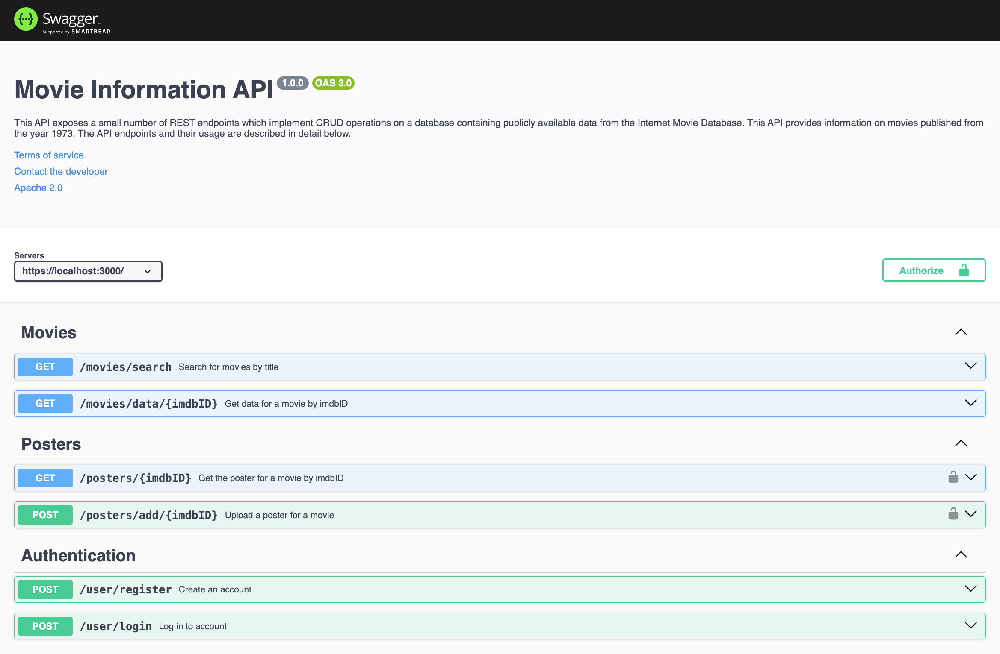
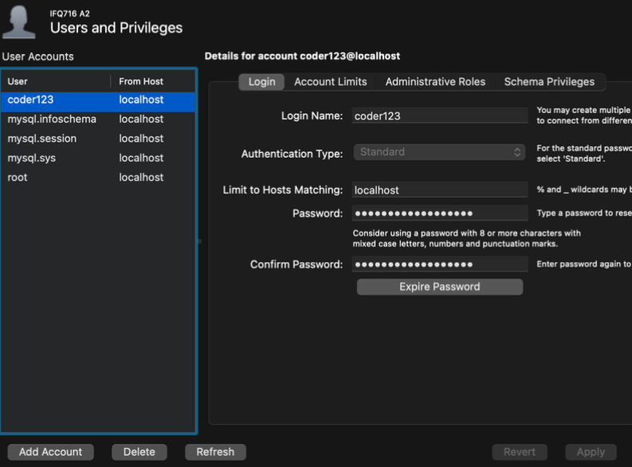

# Movie Information API

## Project Overview
This project involves the development of a Node.js and Express-based API for retrieving and managing movie data stored in a MySQL database. The API is designed to implement RESTful principles and secure data handling practices. It provides functionalities such as searching for movies, retrieving detailed movie information, user authentication, and managing movie posters.



## Features
1. Movie Data Retrieval: Fetch movies by title, year, and other attributes.
2. Detailed Movie Information: Retrieve comprehensive details using IMDb IDs.
3. User Authentication: Secure user registration and login with hashed passwords and JWTs.
4. Poster Management: Upload and retrieve movie posters with file handling support.
5. Secure API: Implements HTTPS, JWT-based authentication, and environment-variable-based configurations for sensitive data.

## Installation Guide
**Step 1.** Set up Node and Visual Studio (VS) Code: 

Download and install applications: 

[Link to install node](https://nodejs.org/en/)

[Link to install vs code](https://code.visualstudio.com/Download)

**Step 2.** Install express and express-generator globally: Open VS Code and run the following in the terminal
```
npm install express express-generator -g
```
**Step 3.** Extract the API files to the desired directory where files were extracted:
```
cd path/to/extracted/project
```
**Step 3.** Install project dependencies:
```
npm install
```
**Step 4.** Install Mysql and Knex in the project directory:
```
npm install knex mysql2 --save
```
**Step 5.** Install additional modules:
```
npm install cors
npm install morgan
npm install swagger-ui-express
npm install jsonwebtoken
npm install dotenv --save
npm install bcrpyt
npm install helmet
npm install knex knex-paginate --save
npm install --save multer
```

**Step 6.** Set up a MySQL Server and MySQL Workbench 

[Download link to MySql Server](https://dev.mysql.com/downloads/installer/)

[Download link to MySQL workbench](https://dev.mysql.com/downloads/workbench/)

**Step 7.** MySQL Workbench setup
1. Download the database:
[Link to database](https://canvas.qutonline.edu.au/courses/1604/assignments/7021)
2. Open MySQLWorkbench and set up a new MySQL connection by pressing the ‘+’ button
3. Under the File tab, select ‘Open new SQL script’ and open ‘movie_small.sql’
4. Run the code by pressing the lightning bolt

**Step 8.** Add tables to MySQL Workbench
1. Open a new SQL query tab
2. To create a users table and posters table run the following code and refresh the
schemas:
```
USE movies;

CREATE TABLE users (
    id INT AUTO_INCREMENT PRIMARY KEY,
    email VARCHAR(255) NOT NULL UNIQUE,
    hash VARCHAR(60) NOT NULL
);

CREATE TABLE posters (
    id INT AUTO_INCREMENT PRIMARY KEY,
    imdbId VARCHAR(10) NOT NULL UNIQUE,
    poster LONGBLOB NOT NULL
);
```

**Step 9.** Add new user
1. Navigate to ‘Users and Privileges’ under the Administration tab
2. Add account and enter login name, host name and password:


3. Update the environmental variable with these:
```
DB_HOST = "127.0.0.1"
DB_NAME = "movies"
DB_USER = "username"
DB_PASSWORD = "password"
```

**Step 10.** Run the server: 
```
npm start
```
**Step 11.** Navigate to the following link in your browser to access the swagger documentation: 

[Local Host Documentation](https://localhost:3000/docs)

## User Guide
A basic guide on how to use the API using Insomnia
1. Download and install Insomnia from [https://insomnia.rest/download](https://insomnia.rest/download)
2. Create a new request collection and then a new request within the project, select the
HTTP request option

**Search for movies by title:**
1. Select GET request and enter the following URL: [https://localhost:3000/movies/search](https://localhost:3000/movies/search)
2. Enter a movie title and optionally the year and/or page number under parameters (no
other parameters are allowed)
3. Click send for list of results

**Retrieve movie data:**
1. Select GET request and enter the following URL with the movie IMDb ID:
[https://localhost:3000/movies/data/{imdbID}](https://localhost:3000/movies/data/{imdbID})
2. Click send for detailed movie information

**Register a new user:**
1. Select POST request and enter the following URL: [https://localhost:3000/user/register](https://localhost:3000/user/register)
2. Under ‘Form’ select ‘Form URL Encoded’ and enter email and password
3. Select the ‘Header’ tab and add the following header: Content-Type: application/x-www-form-urlencoded
4. Click send for confirmation user has been created

**Login to API for access to protected endpoints:**
1. Select POST request and enter the following URL: [https://localhost:3000/user/login](https://localhost:3000/user/login)
2. Enter same email and password in Form URL Encoded
3. Ensure content-type is added to headers as shown in registration route: Content-Type: application/x-www-form-urlencoded
4. Click send to authenticate and receive JWT token

**Upload poster to the database:**
1. Select POST request and enter the following URL with the movie IMDb ID:
[https://localhost:3000/posters/add/{imdbID}](https://localhost:3000/posters/add/{imdbID})
2. Select ‘Bearer Token’ and paste the token received from login route
3. Select ‘Multipart form’, enter imdbID and select poster file (ensure file is selected instead of text)
4. Click send for confirmation poster has been added to the database

**Retrieve movie poster:**
1. Select GET request and enter the following URL with the movie IMDb ID:
[https://localhost:3000/posters/{imdbID}](https://localhost:3000/posters/{imdbID})
2. Select ‘Bearer Token’ and paste the token received from login route
3. Click send for the poster image

## Testing and Limitations
- All endpoints are thoroughly tested using Insomnia.
- Common edge cases and error conditions (e.g., invalid parameters, authentication failures) are handled robustly.
- Reliance on the external OMDB API for additional data introduces some dependency risks.

## Security Features
- HTTPS with TLS: Self-signed certificate used for development.
- Environment Variables: Secure storage for sensitive information.
- Helmet Module: Protects against common vulnerabilities.
- JWT Authentication: Secure access to protected endpoints.
- Bcrypt: Passwords are hashed and salted before storage.